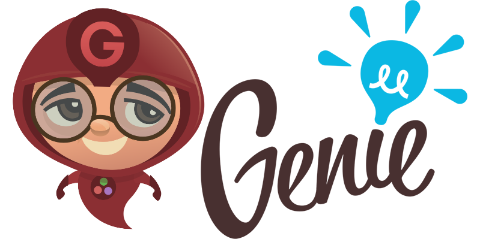

# Genie

## The highly productive Julia web framework

Genie is a full-stack MVC web framework that provides a streamlined and efficient workflow for developing modern web applications. It builds on Julia's strengths (high-level, high-performance, dynamic, JIT compiled), exposing a rich API and a powerful toolset for productive web development.

### Current status

Genie is compatible with Julia v1.3 and up.

---

## Documentation
<https://genieframework.github.io/Genie.jl/dev/>

---

## Acknowledgements

* Genie uses a multitude of packages that have been kindly contributed by the Julia community.
* The awesome Genie logo was designed by Alvaro Casanova.

Developed with Julia and ❤️