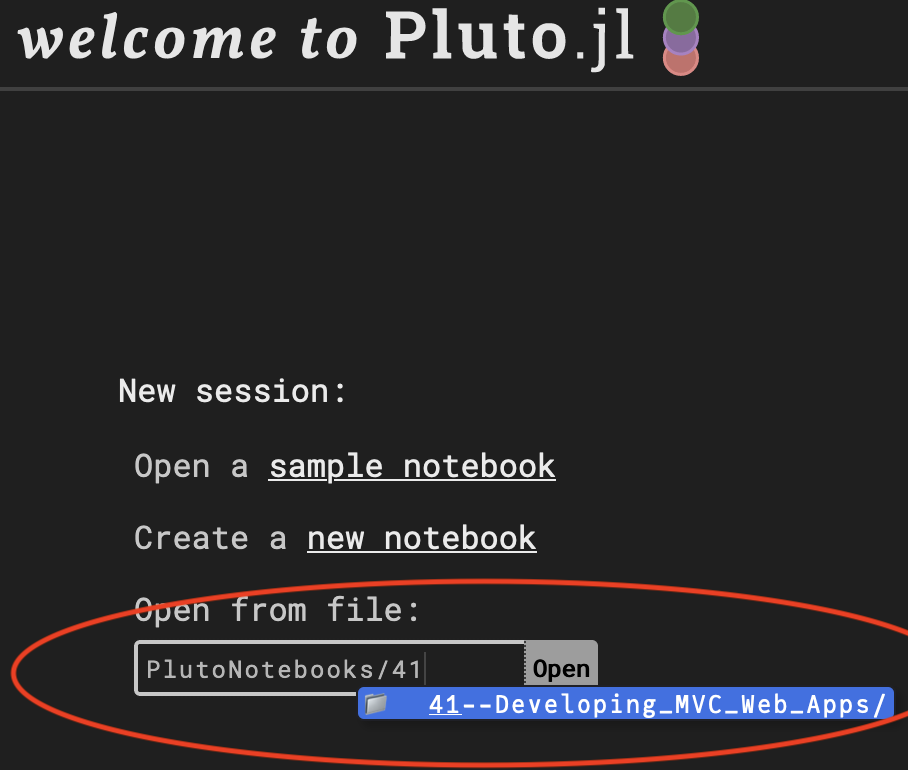

# Editing Guides/Tutorials in Pluto Notebooks:

```shell
$ cd test
test$ julia --project
julia> ]
pkg> activate .
pkg> instantiate
julia> using Pluto
julia> Pluto.run() # will start Pluto server
```

### To edit the guides/tutorials follow the instructions below:

1. Locate the guide/tutorial you want to edit



2. Open the `.jl` notebook and click `open`


3. Once you have opened the notebook wait for notebook to execute all code cells. See the progress in top bar


4. Edit `markdown cell` along with `code cell`(if exists) and then click on save button. Save will execute all the changes and execute the cells


to kill Pluto you can hit `<ctrl/cmd + d>` in terminal

# Testing all notebooks(after you have made changes)

```shell
$ cd test
test$ julia --project

julia> ]
pkg> activate .
pkg> instantiate
julia> include("runner.jl")
```

Passing test should look like this

```shell
Test Summary:     | Pass  Total
Genie Docs Test   |  531    531
     Testing runtest_guides tests passed
```