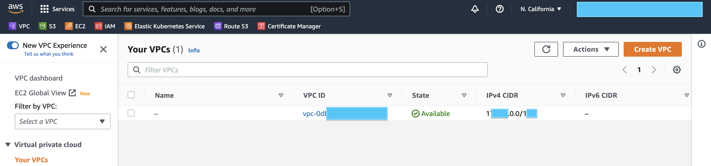

How to deploy Genie applications

In this guide we will walk through how to deploy a Genie App to Amazon Cloud. This article will be added with more information in future.

### Prerequisite:
* Genie Application with ready Dockerfile(Refer to Genie Docker Tutorial)
* Opened account in main cloud providers

That’s it, from this point we can start with deployment.

## AWS

### Networking

The easiest and quickest to deploy and expose Genie applications is to create a EC2 instance and run docker container inside it.

After opening an AWS console you should be able to see your network under VPC tab. This is default one, and we’ll use it for hosting our EC2 instance.



This VPC already contains a predefined subnets. We need a public subnet as we should access our Application via Internet.


Great, let’s move on.

### Setup EC2 instance

Navigate to EC2 tab in AWS Console and then click on “Launch instances“. 


We will use a Free Tier Amazon  Linux 2 AMI image. It can fit our needs for this demo


For an Instance type lets choose t2.small, in that case we’ll get 1vCPU and 2Gb Memory. We should have enough memory with this instance to meet our application requirements. Also we should allow HTTP & HTTPS access. For SSH let’s specify your IP or let 0.0.0.0/0 with is allows connect to this instance from everywhere (not secure). Also double check that “Auto-assign public IP“ is enabled.


Click on "Launch instance". It’ll take around 2min and we can proceed.


Ok, now our Instance is Running and have a public IP.

### Setup Docker on EC2

Now let’s connect to is and install a docker. Here is the command to connect via SSH. Please change this IP by yours.

```
ssh -i my-demo-app.pem ec2-user@13.xx.xxx.x63
```

Let’s Install Docker on it, it’s pretty easy, just execute next commands:

```
sudo yum update
sudo yum install docker -y
sudo usermod -a -G docker ec2-user
id ec2-user
newgrp docker
sudo systemctl enable docker.service
sudo systemctl start docker.service
```

Now we can verify that our docker was installed and runs successfully

```
sudo systemctl status docker.service
```

For more information you can check this [guide](https://www.cyberciti.biz/faq/how-to-install-docker-on-amazon-linux-2/). Amazing, basically that’s it, now we can deploy our application.

Let’s clone repository with our applications and Dockerfile to EC2. If git is not installed on EC2 just execute

```
sudo yum git install -y
# And clone your git repo
git clone <your-repo.git>
cd <your-repo>
```

### Building a Genie Application

First of all let’s build our app using docker cli

```
docker build -t my-demo-app .
docker images 
```

If build was successful your should be able to see docker image. Now let’s just start it. In our case application works on port 8000, so we did a port-mapping to port 80.

```
docker run -p 80:8000 my-demo-app
```

Then just grep a public IP from AWS console and open it in your browser.


That’s it, your application was successfully deployed. Thanks.